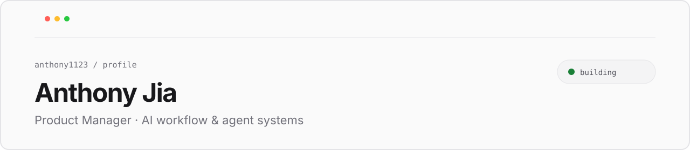

  <picture>
    <source media="(prefers-color-scheme: dark)" srcset="./assets/profile-header-dark.svg">
    <source media="(prefers-color-scheme: light)" srcset="./assets/profile-header-light.svg">
    
  </picture>

 

> 摄影｜旅游｜徒步｜数码｜笛子｜乒乓球 
> vibe coding｜外企 PM

 

### Now

正在探索 **AI Agent 工作流**，关注让复杂任务变得更清晰、更可控、更好用的 B 端产品体验。 
**寻找 AI Agent 工作流或 B 端平台工具类产品经理的岗位 ❤️**

 

### Selected work

|  | Project | What it is |
| :-- | :-- | :-- |
| `01` | [Personal CV](https://github.com/anthony1123/Personal_CV) | 个人简历与经历展示 |
| `02` | [AI Workflow](https://github.com/anthony1123/AI_workflow) | AI 工作流的探索与实践 |
| `03` | [Agent System](https://github.com/anthony1123/agent-system) | 面向 Agent 系统的产品思考与构建 |

 

---

  Made with curiosity, somewhere between a product brief and a long walk.

